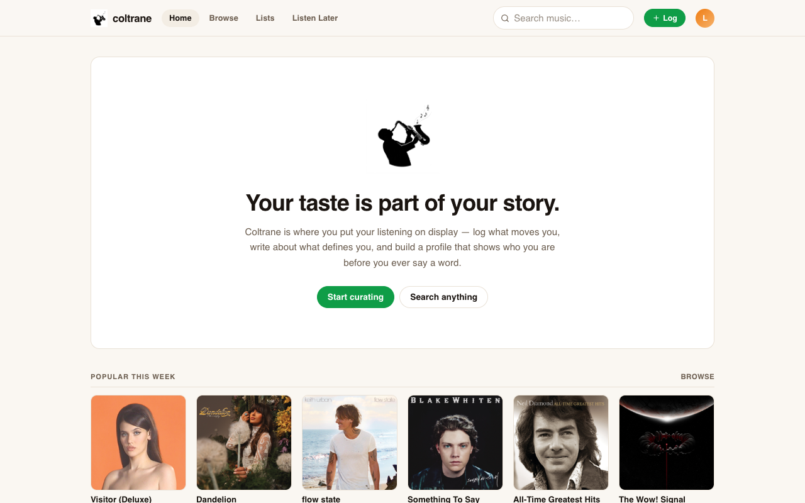
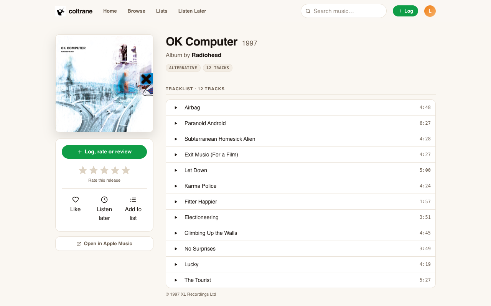
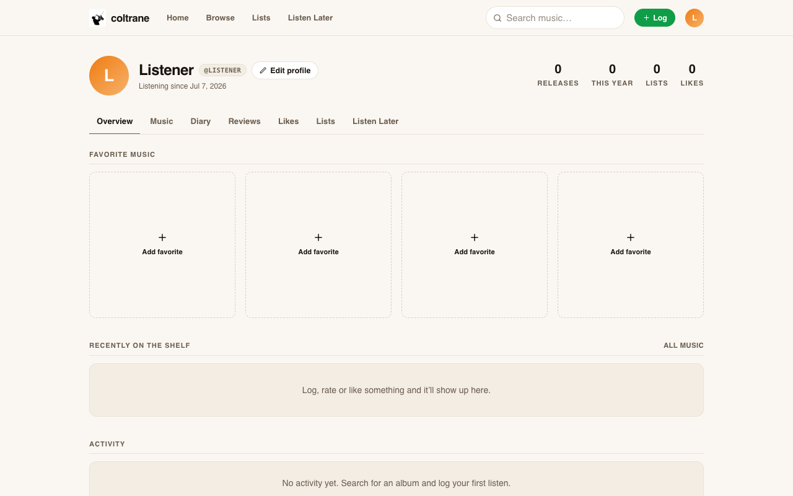

# coltrane

**Your taste, on display.** Coltrane is a listening diary where you log albums, EPs,
singles and songs, rate and review them, keep a Listen Later queue, like things, and
build ranked lists — all on a profile that shows who you are through what you listen to.

<p align="center">
  
</p>

<p align="center">
  
  &nbsp;&nbsp;
  
</p>
<p align="center"><sub><strong>Release page</strong> · log, rate, preview tracks &nbsp;|&nbsp; <strong>Profile</strong> · your shelf, diary, and activity</sub></p>

## Features

- **Log listens** — the `+ Log` button (or any cover's hover actions) opens a diary
  entry: listen date, half-star rating (0.5–5), review text, like, and a "relisten" flag.
- **Ratings** — hover-for-half-stars picker, on release pages and in the log form.
- **Diary** — every listen grouped by month with day numbers, ratings, likes and review markers. Entries are editable and deletable.
- **Reviews** — all your written reviews in one feed.
- **Likes** — heart anything; liked releases get their own tab.
- **Listen Later** — queue releases you want to spin. Logging a listen clears it from the queue automatically.
- **Lists** — create, describe, reorder (up/down) and delete lists; add from any cover or release page.
- **Profile** — avatar, display name, bio, four favorite-music slots, stats (releases, this year, lists, likes) and an activity feed.
- **Album art everywhere** — covers come straight from the Apple catalog and upscale to
  600px+ on detail pages.
- **Release pages** — full tracklists with 30-second audio previews, genre/track-count
  chips, artist links and an Apple Music outlink.
- **Artist pages** — full discography split into albums vs. singles & EPs.
- **Browse** — the current most-played albums chart to fill an empty shelf fast.

## Stack

- [Vite](https://vite.dev) + React 19 + TypeScript
- [Tailwind CSS v4](https://tailwindcss.com) for styling
- [zustand](https://zustand.docs.pmnd.rs) with `persist` — your whole diary lives in
  `localStorage` (`coltrane-v1`), no account or backend needed
- [iTunes Search API](https://performance-partners.apple.com/search-api) — free,
  keyless, CORS-enabled catalog + artwork + previews
- React Router 7

## Run it

```bash
npm install
npm run dev      # http://localhost:5173
```

Production build:

```bash
npm run build
npm run preview
```

## Notes

- All personal data (logs, ratings, likes, lists, profile) is stored locally in the
  browser. "Reset all data" in Edit Profile wipes it.
- The catalog requires an internet connection; everything you've already logged is
  cached in the store and keeps working offline.
